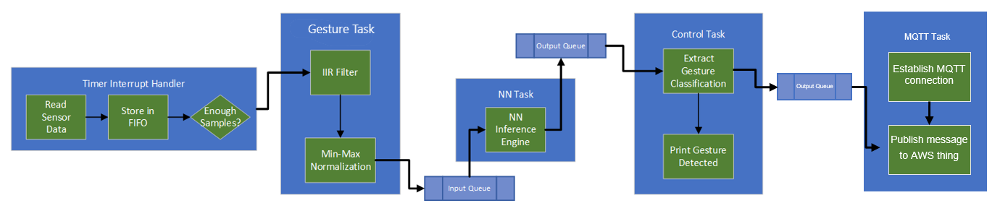

# AWS IoT and FreeRTOS for PSoC&trade; 64 MCU: MQTT ML gesture classification

This code example demonstrates how to perform gesture classification based on motion sensor (accelerometer and gyroscope) data using PSoC&trade; 64 and ModusToolbox&trade; software. It comes with a pre-trained model that classifies the following gestures: circle, square, and side-to-side. The classified gesture is then published to the AWS Thing via MQTT.

For more details, see the [ModusToolbox&trade; Machine Learning solution](https://www.cypress.com/products/modustoolbox/machine-learning).

[View this README on GitHub.](https://github.com/Infineon/afr-example-mqtt-ml-gesture-classification)

[Provide feedback on this Code Example.](https://cypress.co1.qualtrics.com/jfe/form/SV_1NTns53sK2yiljn?Q_EED=eyJVbmlxdWUgRG9jIElkIjoiQ0UyMzM2OTQiLCJTcGVjIE51bWJlciI6IjAwMi0zMzY5NCIsIkRvYyBUaXRsZSI6IkFXUyBJb1QgYW5kIEZyZWVSVE9TIGZvciBQU29DJnRyYWRlOyA2NCBNQ1U6IE1RVFQgTUwgZ2VzdHVyZSBjbGFzc2lmaWNhdGlvbiIsInJpZCI6ImRka2EiLCJEb2MgdmVyc2lvbiI6IjEuMC4wIiwiRG9jIExhbmd1YWdlIjoiRW5nbGlzaCIsIkRvYyBEaXZpc2lvbiI6Ik1DRCIsIkRvYyBCVSI6IklDVyIsIkRvYyBGYW1pbHkiOiJQU09DIn0=)

**Disclaimer:** The model provided is an example and may need customization for generalization or to meet certain performance criteria. If you require large-scale production, contact your sales representative.

## Requirements

- [ModusToolbox™ software](https://www.cypress.com/products/modustoolbox-software-environment) v2.3 or later (tested with v2.4)
- [Amazon FreeRTOS software](https://github.com/aws/amazon-freertos) v202107.00
- Programming Language: C
- Associated Parts: [PSoC&trade; 64](http://www.cypress.com/PSoC64) parts

## Supported toolchains (make variable 'TOOLCHAIN')

- GNU Arm® embedded compiler v9.3.1 (`GCC_ARM`) - Default value of `TOOLCHAIN`

## Supported Kits

- [PSoC&trade; 64 "Secure Boot" Wi-Fi Bluetooth&reg; pioneer kit](http://www.cypress.com/CY8CKIT-064S0S2-4343W) (`CY8CKIT-064S0S2-4343W`) - Default value of `TARGET`


## Hardware Setup

Connect the CY8CKIT-028-TFT shield to the header of your baseboard, which is compatible with Arduino.

See the [Operation](#operation) section for more information.

## Software Setup

Install a terminal emulator if you don't have one. Instructions in this document use [Tera Term](https://ttssh2.osdn.jp/index.html.en).

By default, the Makefile uses a model that comes with the code example. The pre-trained neural net (NN) model is located in the *pretrained_models* folder. The output files location is set to *mtb_ml_gen*; the project name is set to *magic_wand*. You can use the MTB-ML Configurator Tool to open the *design.mtbml* model to evaluate the model.

## Using the code example

### First steps:

1. Clone FreeRTOS from GitHub and check out the latest release using its tag. The following command also clones all the submodules.
   ```
   git clone --recurse-submodules https://github.com/aws/amazon-freertos.git --branch 202107.00
   ```

2. Go to *\<amazon-freertos>/projects/cypress* folder.

   **Note:** *\<amazon-freertos>* refers to the path of the FreeRTOS folder in your computer.


3. Clone or download this code example, or copy it if you already have it.
   ```
   git clone https://github.com/Infineon/afr-example-mqtt-ml-gesture-classification.git
   ```

4. Create a Thing and name it anything meaningful. Open *\<amazon-freertos>/demos/include/aws_clientcredential.h* file and configure the SSID, Wi-Fi password of the desired network, and AWS parameters such as endpoint and Thing name.


5. Configure the client certificate and the private key in *\<amazon-freertos>/demos/include/aws_clientcredential_keys.h* for the Thing used in Step 4.

6. Connect the kit to your PC using the provided USB cable through the USB connector.

7. Open a terminal program and select the KitProg3 COM port. Set the serial port parameters to 8N1 and 115200 baud.

### In Eclipse IDE for ModusToolbox&trade;:

- See [Running FreeRTOS code examples using Eclipse IDE for ModusToolbox&trade; - KBA228845](https://community.infineon.com/t5/Knowledge-Base-Articles/Running-Amazon-FreeRTOS-Code-Examples-KBA228845/ta-p/249755) to import the project into Eclipse IDE.

### Using command-line interface (CLI):

1. Open a CLI terminal and navigate to the CE folder.

2. From the terminal, execute the `make program` command to build and program the application using the default toolchain to the default target. You can specify a target and toolchain manually:

   ```
   make program TARGET=<BSP> TOOLCHAIN=<toolchain>
   ```
   Example:

   ```
   make program TARGET=CY8CKIT_064S0S2_4343W TOOLCHAIN=GCC_ARM
   ```

### Using CMake:

1. Create a build folder (e.g., *cmake_build*) under *\<amazon-freertos>/build*.

2. Navigate to the path *\<amazon-freertos>/vendors/cypress/boards/CY8CKIT_064S0S2_4343W* and edit the *CMakeLists.txt* file to add "HARDFP" at the end of the COMPONENTS list as shown below on line 182:

   ```
   COMPONENTS "4343W;CAPSENSE;TFM_NS_FREERTOS_WRAPPER;TFM_NS_INTERFACE;HARDFP"
   ```

3. Navigate to the path *\<amazon-freertos>/vendors/cypress/MTB/psoc6/cmake/toolchains* and edit *arm-gcc.cmake* file to change the VFP flags to use "hard" instead of "softfp" as shown below on line 15:

   ```
   set(ENV{VFP_FLAGS} "-mfloat-abi=hard;-mfpu=fpv4-sp-d16")
   ```

4. Run the following command from the build folder:

   ```
   cmake -G Ninja -S ../.. -B . -DVENDOR=cypress -DCOMPILER=arm-gcc -DBOARD=CY8CKIT_064S0S2_4343W -DAPP=projects/cypress/afr-example-mqtt-ml-gesture-classification
   ```


5. Once CMake has generated the configuration, run the following command:

   ```
   cmake --build .
   ```

6. Use [Cypress Programmer](hhttps://www.infineon.com/cms/en/design-support/tools/programming-testing/psoc-programming-solutions/) to program the *afr-example-mqtt-ml-gesture-classification.elf* file generated under *\<amazon-freertos>/build/cmake_build*.


## Operation

This code example uses the CY8CKIT-064S0S2-4343W PSoC™ 64 "Secure" MCU kit. The PSoC™ 64 device must be provisioned with keys and policies before being programmed. Follow the instructions in the [CY8CKIT-064S0S2-4343W-Kit provisioning guide](https://community.infineon.com/t5/Resource-Library/Provisioning-Guide-for-the-Cypress-CY8CKIT-064S0S2-4343W-Kit/ta-p/252469) to provision the device. See **Note** below before you proceed.

**Note:** The code example uses its own custom policy. The policy files must be copied from *custom_policy* folder to the *\<amazon-freertos>\vendors\cypress\MTB\psoc6\psoc64tfm\security\policy* folder after the `cysecuretools init` is run. Overwrite the existing policies. You can then proceed to provision the device. If the kit is already provisioned, you will need to re-provision the device with the above custom policy and new keys.

1. Connect the board to your PC using the provided USB cable through the KitProg3 USB connector.

2. Open a terminal program and select the KitProg3 COM port. Set the serial port parameters to 8N1 and 115200 baud.

3. Program the board.

   - **Using Eclipse IDE for ModusToolbox&trade;:**

      1. Select the application project in the Project Explorer.

      2. In the **Quick Panel**, scroll down, and click **\<Application Name> Program (KitProg3)**.

   - **Using CLI:**

     From the terminal, execute the `make program` command to build and program the application using the default toolchain to the default target. You can specify a target and toolchain manually:
      ```
      make program TARGET=<BSP> TOOLCHAIN=<toolchain>
      ```

      Example:
      ```
      make program TARGET=CY8CKIT_064S0S2_4343W TOOLCHAIN=GCC_ARM
      ```

4. After programming, the application starts automatically and tries to connect to the Wi-Fi AP. You should see the `"STARTING DEMO"` message displayed on the serial terminal once the AP is connected.

   **Figure 1. Startup screen in the terminal**

   

   **Note:** If you see the program restarting every few seconds, it is because the 028-TFT shield is probably not connected and the watchdog is causing the reset.

5. The gesture classifications and confidence are updated continuously and will be visible n the serial terminal once the startup sequence is complete. The MQTT task may take few seconds for the secure TLS connection to be established; this will be displayed in the serial terminal once completed.

   **Note:** To view the debug logging information of the MQTT task, comment out line 159 in *source/control.c* file:
   ```
   //printf("\x1b[2J\x1b[;H");
   ```

6. Hold the board with the following orientation while moving your arm to complete a gesture:

   **Figure 2. Board orientation**

   

7. Perform a counter-clockwise circle movement continuously. Confirm that the UART terminal prints the gesture as [**Circle**](https://github.com/Infineon/mtb-example-ml-gesture-classification/blob/master/images/circle.gif), and the confidence of the circle increases past 97%. For best results, repeatedly perform a circle movement that has a diameter of one foot, and complete one circle per second.

   **Figure 3. Circle gesture**

   


8. Perform a counter-clockwise square movement continuously. Confirm that the UART terminal prints the gesture as [**Square**](https://github.com/Infineon/mtb-example-ml-gesture-classification/blob/master/images/square.gif), and the confidence of the square increases past 97%. For best results, repeatedly perform a square movement that has a side length of one foot, and complete one square in two seconds.

   **Figure 4. Square gesture**

   


9. Perform a side-to-side movement (left <-> right) continuously, and confirm that the UART terminal prints the gesture as [**Side-to-side**](https://github.com/Infineon/mtb-example-ml-gesture-classification/blob/master/images/side-to-side.gif), and the confidence increases past 97%. For best results, repeatedly perform a one-foot-wide left-to-right movement in half-a-second.

   **Figure 5. Side-to-side gesture**

   


10. When not performing any of these gestures, confirm that the UART terminal prints the gesture as **None**.

**Note:** If the confidence is lower than 97%, the gesture will register as **None**.

**Note:** Figures 2-4 above may have low frame rates. Click on the link to redirect to GitHub for better quality.


## Debugging

You can debug the example to step through the code. In the IDE, use the **\<Application Name> Debug (KitProg3)** configuration in the **Quick Panel**. For more details, see the "Program and debug" section in the Eclipse IDE for ModusToolbox&trade; user guide: *{ModusToolbox&trade; install directory}/ide_{version}/docs/mt_ide_user_guide.pdf*.

**Note:** **(Only while debugging)** On the CM4 CPU, some code in `main()` may execute before the debugger halts at the beginning of `main()`. This means that some code executes twice - before the debugger stops execution, and again after the debugger resets the program counter to the beginning of `main()`. See [KBA231071](https://community.infineon.com/t5/Knowledge-Base-Articles/PSoC-6-MCU-Code-in-main-executes-before-the-debugger-halts-at/ta-p/253856) to learn about this and for the workaround.

## Design and implementation

### Resources and settings

In this example, the firmware reads the data from a motion sensor (BMX160) to detect gestures. The data consists of 3-axis orientation data from the accelerometer and 3-axis orientation data from the gyroscope. A timer is configured to interrupt at 128 Hz. The interrupt handler reads all 6 axes through SPI and signals a task to process the batch of samples when the internal FIFO has 128 new samples. It performs an IIR filter and a min-max normalization on 128 samples at a time. This processed data is then fed to the inference engine. The inference engine outputs the confidence of the gesture for each of the four gesture classes. If the confidence passes a certain percent, the gesture is printed to the UART terminal.

The code example also provides the MTB-ML Configurator tool project file - *design.mtbml*, which points to the pre-trained NN model available in the *pretrained_models* folder.

This application uses FreeRTOS. There are two tasks in the system - *gesture task* and *mqtt task*. The gesture task pre-processes all data and passes the data to the inference engine. The inferred gesture is then fed into the queue. The mqtt task reads this queue and publishes the detected gesture to the AWS Thing. FreeRTOS is used so that the code example can be expanded.

**Figure 6. Block diagram**




### Gesture classification model

The convolutional neural network (CNN) model consists of two convolutional blocks and two full-connection layers. Each convolutional block includes convolutional operations, including rectified linear unit (ReLU) and max pooling, with the addition of a batch normalization layer after the first block. The convolutional layers act as feature extractors and provide abstract representations of the input sensor data in feature maps. They capture short-term dependencies (spatial relationships) of the data. In the CNN, features are extracted and then used as inputs of fully connected network, using softmax activation for classification.

**Figure 3. Model diagram**


### Files and folders

```
|-- mtb_ml_gen/                              # Contains the model files
|-- pretrained_models/                       # Contains the H5 format model (used by the ML Configurator tool)
|-- source                                   # Contains the source code files for this example
   |- BMM150-Sensor-API
      |- bmm150.c/.h                         # BMM150 sensor driver files
      |- bmm150_defs.h                       # BMM150 sensor defines
   |- cJson
      |- cJSON.c/.h                          # Implements JSON parsing/packaging
   |- ml-inference                           # Contains files for ML inference engine
   |- ml-middleware                          # Contains files for ML model processing and other utilities
   |- sensor-motion-bmi160
      |- mtb_bmi160.c/.h                     # Contains BMI160 motion sensor middleware files
   |- gesture.c/h                            # Implements the gesture task
   |- processing.c/h                         # Implements the IIR filter and normalization functions
   |- control.c/h                            # Implements the control task
   |- mqtt_operation.c/.h                    # Implements the MQTT task
   |- iot_demo_mqtt_ml_gesture_classifier.c  # Creates all the tasks
|-- fifo                                     # Contains a FIFO library
   |- cy_fifo.c/h                            # Implements a FIFO in firmware
|-- config_files
   |- FreeRTOSConfig.h                       # FreeRTOS Configuration file
|--arm_math.h                                # Custom Arm&reg; CMSIS Math file
|-- custom_linker_scripts                    # Custom linker script for toolchains
|-- design.mtbml                             # MTB-ML Configurator tool project file
```


## Related resources

Resources  | Links
-----------|----------------------------------
Application notes  | [AN228571](https://www.cypress.com/AN228571) – Getting started with PSoC&trade; 6 MCU on ModusToolbox&trade; software <br>  [AN215656](https://www.cypress.com/AN215656) – PSoC&trade; 6 MCU: Dual-CPU system design
Code examples  | [Using ModusToolbox&trade; software](https://github.com/Infineon/Code-Examples-for-ModusToolbox-Software) on GitHub
Device documentation | [PSoC&trade; 6 MCU datasheets](https://www.cypress.com/search/all?f[0]=meta_type%3Atechnical_documents&f[1]=resource_meta_type%3A575&f[2]=field_related_products%3A114026) <br> [PSoC&trade; 6 technical reference manuals](https://www.cypress.com/search/all/PSoC%206%20Technical%20Reference%20Manual?f[0]=meta_type%3Atechnical_documents&f[1]=resource_meta_type%3A583)
Development kits | Visit www.cypress.com/microcontrollers-mcus-kits and use the options in the **Select your kit** section to filter kits by *Product family* or *Features*.
Libraries on GitHub  | [mtb-pdl-cat1](https://github.com/infineon/mtb-pdl-cat1) – PSoC&trade; 6 peripheral driver library (PDL)  <br> [mtb-hal-cat1](https://github.com/infineon/mtb-hal-cat1) – Hardware abstraction layer (HAL) library <br> [retarget-io](https://github.com/infineon/retarget-io) – Utility library to retarget STDIO messages to a UART port
Middleware on GitHub  | [ml-inference](https://github.com/Infineon/ml-inference) - ML Inference Engine library <br> [psoc6-middleware](https://github.com/Infineon/modustoolbox-software#psoc-6-middleware-libraries) – Links to all PSoC&trade; 6 MCU middleware <br>
Tools <br>   | [Eclipse IDE for ModusToolbox&trade; software](https://www.cypress.com/modustoolbox) – ModusToolbox&trade; software is a collection of easy-to-use software and tools enabling rapid development with Infineon MCUs, covering applications from embedded sense and control to wireless and cloud-connected systems using AIROC&trade; Wi-Fi and Bluetooth® connectivity devices.
<br>

## Other resources

Infineon provides a wealth of data at www.infineon.com to help you select the right device, and quickly and effectively integrate it into your design.

For PSoC&trade; 6 MCU devices, see [How to design with PSoC&trade; 6 MCU - KBA223067](https://community.infineon.com/t5/Knowledge-Base-Articles/How-to-Design-with-PSoC-6-MCU-KBA223067/ta-p/248857) in the Cypress community.

For more information on Secure Boot, see [Secure Boot SDK user guide](https://www.cypress.com/documentation/software-and-drivers/psoc-64-secure-mcu-secure-boot-sdk-user-guide).

## Document history

Document title: *CE233694* - *AWS IoT and FreeRTOS for PSoC&trade; 64 MCU: MQTT ML gesture classification*

| Version | Description of change |
| ------- | --------------------- |
| 1.0.0   | New code example      |


-------------------------------------------------------------------------------

© Cypress Semiconductor Corporation, 2022. This document is the property of Cypress Semiconductor Corporation, an Infineon Technologies company, and its affiliates ("Cypress").  This document, including any software or firmware included or referenced in this document ("Software"), is owned by Cypress under the intellectual property laws and treaties of the United States and other countries worldwide.  Cypress reserves all rights under such laws and treaties and does not, except as specifically stated in this paragraph, grant any license under its patents, copyrights, trademarks, or other intellectual property rights.  If the Software is not accompanied by a license agreement and you do not otherwise have a written agreement with Cypress governing the use of the Software, then Cypress hereby grants you a personal, non-exclusive, nontransferable license (without the right to sublicense) (1) under its copyright rights in the Software (a) for Software provided in source code form, to modify and reproduce the Software solely for use with Cypress hardware products, only internally within your organization, and (b) to distribute the Software in binary code form externally to end users (either directly or indirectly through resellers and distributors), solely for use on Cypress hardware product units, and (2) under those claims of Cypress’s patents that are infringed by the Software (as provided by Cypress, unmodified) to make, use, distribute, and import the Software solely for use with Cypress hardware products.  Any other use, reproduction, modification, translation, or compilation of the Software is prohibited.
<br>
TO THE EXTENT PERMITTED BY APPLICABLE LAW, CYPRESS MAKES NO WARRANTY OF ANY KIND, EXPRESS OR IMPLIED, WITH REGARD TO THIS DOCUMENT OR ANY SOFTWARE OR ACCOMPANYING HARDWARE, INCLUDING, BUT NOT LIMITED TO, THE IMPLIED WARRANTIES OF MERCHANTABILITY AND FITNESS FOR A PARTICULAR PURPOSE.  No computing device can be absolutely secure.  Therefore, despite security measures implemented in Cypress hardware or software products, Cypress shall have no liability arising out of any security breach, such as unauthorized access to or use of a Cypress product. CYPRESS DOES NOT REPRESENT, WARRANT, OR GUARANTEE THAT CYPRESS PRODUCTS, OR SYSTEMS CREATED USING CYPRESS PRODUCTS, WILL BE FREE FROM CORRUPTION, ATTACK, VIRUSES, INTERFERENCE, HACKING, DATA LOSS OR THEFT, OR OTHER SECURITY INTRUSION (collectively, "Security Breach").  Cypress disclaims any liability relating to any Security Breach, and you shall and hereby do release Cypress from any claim, damage, or other liability arising from any Security Breach.  In addition, the products described in these materials may contain design defects or errors known as errata which may cause the product to deviate from published specifications. To the extent permitted by applicable law, Cypress reserves the right to make changes to this document without further notice. Cypress does not assume any liability arising out of the application or use of any product or circuit described in this document. Any information provided in this document, including any sample design information or programming code, is provided only for reference purposes.  It is the responsibility of the user of this document to properly design, program, and test the functionality and safety of any application made of this information and any resulting product.  "High-Risk Device" means any device or system whose failure could cause personal injury, death, or property damage.  Examples of High-Risk Devices are weapons, nuclear installations, surgical implants, and other medical devices.  "Critical Component" means any component of a High-Risk Device whose failure to perform can be reasonably expected to cause, directly or indirectly, the failure of the High-Risk Device, or to affect its safety or effectiveness.  Cypress is not liable, in whole or in part, and you shall and hereby do release Cypress from any claim, damage, or other liability arising from any use of a Cypress product as a Critical Component in a High-Risk Device. You shall indemnify and hold Cypress, including its affiliates, and its directors, officers, employees, agents, distributors, and assigns harmless from and against all claims, costs, damages, and expenses, arising out of any claim, including claims for product liability, personal injury or death, or property damage arising from any use of a Cypress product as a Critical Component in a High-Risk Device. Cypress products are not intended or authorized for use as a Critical Component in any High-Risk Device except to the limited extent that (i) Cypress’s published data sheet for the product explicitly states Cypress has qualified the product for use in a specific High-Risk Device, or (ii) Cypress has given you advance written authorization to use the product as a Critical Component in the specific High-Risk Device and you have signed a separate indemnification agreement.
<br>
Cypress, the Cypress logo, and combinations thereof, WICED, ModusToolbox, PSoC, CapSense, EZ-USB, F-RAM, and Traveo are trademarks or registered trademarks of Cypress or a subsidiary of Cypress in the United States or in other countries. For a more complete list of Cypress trademarks, visit cypress.com. Other names and brands may be claimed as property of their respective owners.
